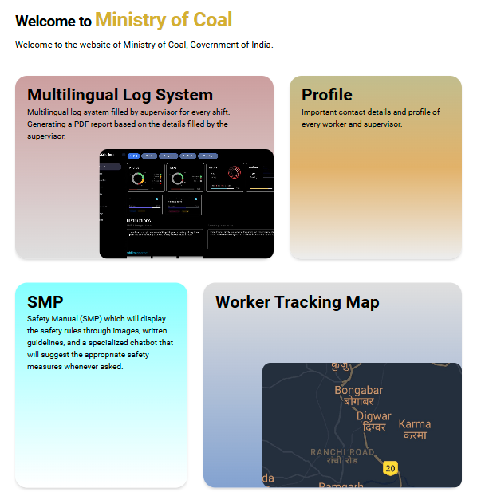
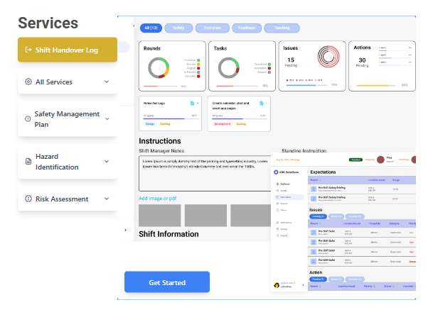
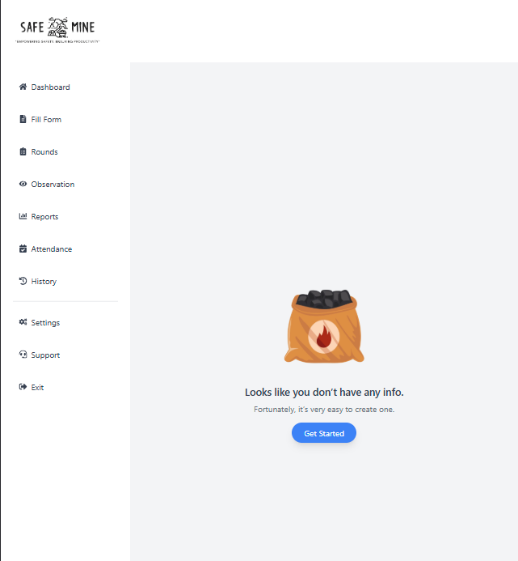
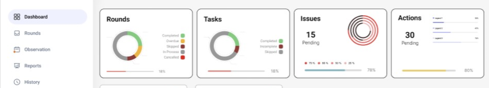
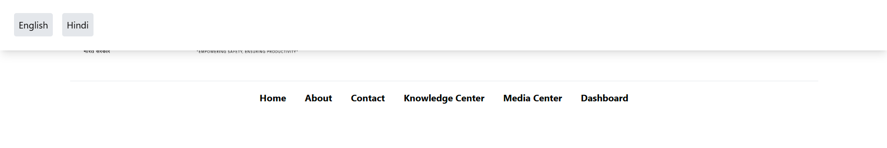

# Safemine - EMPOWERING SAFETY, ENSURING PRODUCTIVITY

**Safemine** is a next-generation digital platform designed to modernize the coal mining industry by enhancing safety protocols, streamlining shift operations, and ensuring multilingual accessibility. Our platform offers a comprehensive solution for real-time logging, worker tracking, and risk management.

---

## Problem

Coal mining operations face several challenges, including:

- **Manual Shift Logs**: Inefficiencies and delays due to paper-based logs.
- **Safety Management Issues**: Lack of real-time monitoring and delay in executing safety protocols.
- **Language Barriers**: Communication breakdowns due to linguistic diversity.
- **Incident Tracking & Monitoring Gaps**: Sluggish manual processes increase safety risks.
- **Proactive Risk Management Deficiency**: Existing systems lack the ability to predict hazards.

---

## Solution

**Safemine** addresses these challenges through its suite of features:

- **Digital Shift Handover Logs**: Replaces manual logs with real-time, structured digital data.
- **Multilingual Support**: Available in English and  Hindi for smooth communication.
- **DGMS-Aligned Safety Management Plan (SMP)**: Real-time safety protocol monitoring based on DGMS guidelines.
- **Automated Reporting**: One-click PDF reports for fast, reliable shift summaries.
- **Risk Estimator**: A real-time tool to calculate risk based on safety data and shift logs.
- **Complaint Lodging & Tracking**: A system to report and resolve operational issues efficiently.

---

## Project Overview

Safemine is built using the **MERN stack** (MongoDB, Express, React, Node.js) to ensure scalability, performance, and security. The website provides a **dashboard** that allows users to track records of shifts, safety protocols, and worker activities digitally. It also enables exporting these records in **PDF format** for ease of reporting and further analysis.

---

## Features

- **Dashboard**: Centralized location to monitor shift operations, track worker movements, and log incidents in real-time.
- **Real-time Shift Logging**: Log shift details digitally and access historical data.
- **PDF Export**: Export logs, reports, and summaries in PDF format with one-click functionality.
- **Worker Report**: Keep the  worker report. 
- **Multilingual Interface**: Supports multiple languages for broader accessibility in coal mining areas.
- **Risk Estimator**: Evaluate the risk level of a shift based on safety logs and worker data.
- **Incident Management**: Report and track operational issues in real-time.

---

## Technologies Used

- **Frontend**: React
- **Backend**: Node.js, Express.js
- **Database**: MongoDB
- **Authentication**: JWT (JSON Web Tokens)

---

### Screenshot

## Contact
For queries, suggestions, or contributions, contact:
- **Name**: Shivanshu Kashyap
- **Email**: shivanshukashyap996@gmail.com

---

## License
This project is licensed under the MIT License.

